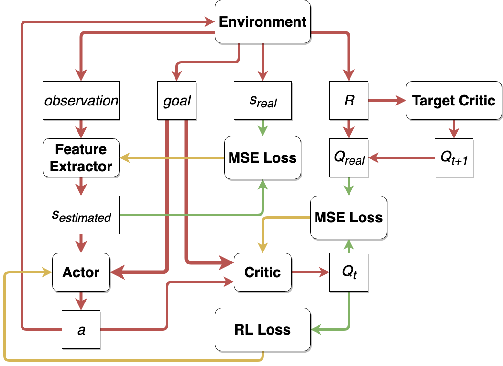
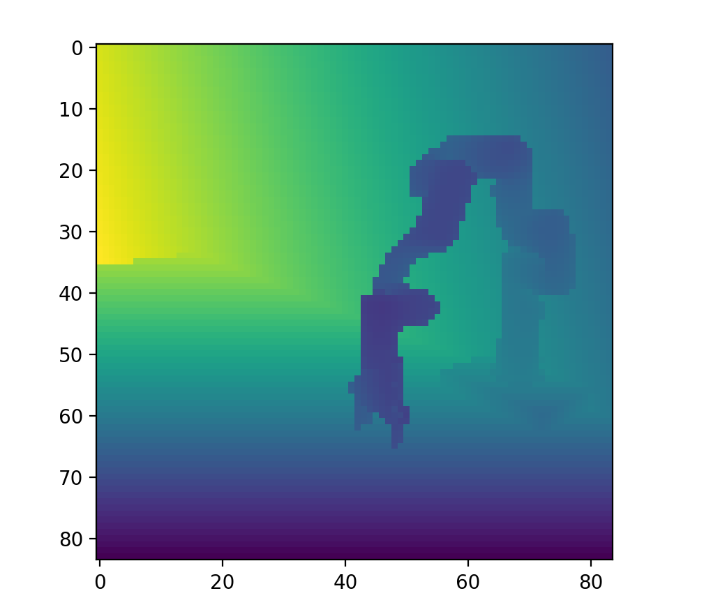

Lately, Robotics has become a major playfield for Reinforcement Learning. Learning-based algorithms have the potential to enable robots to acquire complex behaviors adaptively in unstructured environments by leveraging data collected from the environment. In particular, with reinforcement learning, robots learn novel behaviors through trial and error interactions. This unburdens the human operator from having to pre-program accurate behaviors. This is particularly important as we deploy robots in scenarios where the environment may not be known.

However, not only is training in the real world very time consuming, it also puts the robots and the environment in considerable risk. To evade these problems, training in simulation and then transferring to the real is becoming a popular strategy. Training in simulation can lead to substantial speed-ups because of the possibility of parallelization without any significant extra costs.

But these models trained in Simulation suffer from what is termed as the Reality Gap. This reality gap might arise because of multiple reasons such as omitting some physical phenomena, having inaccurate parameterized values of physical quantities or even small numerical approximations in typical solvers. One can argue that ideally all of these could be solved by building more accurate simulators, but that's easier said than done. Moreover, the real world itself is non-stationary!

Our project deals with exploring methods to reduce this sim2real gap and deploy a model trained to do the Reach task in simulation on a real Xarm7 robot. Our goal is to deploy the model in the real world, with nothing but images as the current state input.

# Training Setup
We use Mujoco for simulating our environment and depicted the real robot setup interms of color and camera position as closely as possible.
Training in simulaiton provides many advatages. The most important amongst those is access to state variables instead of just the images. This allows us to speed up training by using [Asymmetric Actor Critic](https://arxiv.org/abs/1710.06542) model.
The Asymmetric Actor Critic uses a [DDPG](https://spinningup.openai.com/en/latest/algorithms/ddpg.html) based approach, where the Actor gets image-based inputs but the Critic at the time of training gets state-based input.

### Feature Extractor
We use a 3 layer Conv network to extract the current state (a 3D coordinate of the end effector's possition) from the Current state image (84x84x3) input. It is this state estimation using the feature extractor that is passed to the Actor in Test and Training time. Besides the RL loss that is backpropagated by the Actor Network, we also add an additional loss called the Bottleneck loss on the feature exctractor to speed up training. The Bottleneck loss minimizes the difference between the actual state (which we get at the time of training) and the predicted loss by the feature extractor.

The loss function for the feature extractor looks something like -

$$ L_f = L_{RL}  + MSE(s,s_{predicted}) $$

The Bottleneck loss also led to significant speed gains in training the feature extractor.

### Actor Network
The Actor takes in the predicted current state output from the feature extractor and the goal as a 3D coordinate as input, and outputs a 3D vector equivalent of the displacement in the 3D space.
The actor optamizes on the loss-

$$ L_a = -E_s[Q(s,\pi(s))] $$
Where $$ Q(s,\pi(s)) $$ is the estimated Q-value by the Critic.
During deployment we only use the output of the actor.

### Critic Network
The Critic takes in the action yielded by the Actor along with the current state as a 3D coordinate of the end effector and the goal as a 3D coordinate as input. It outputs the predicted Q-value of the action given the current state and goal as a single float value.
The critic tries to optamize over the follwoing loss function-

$$ L_c = ( Q(s_t,a_t) - r_t - \gamma Q_T(s_{t+1},\pi(s_{t+1}) )  )^2 $$

Here the $$ Q_T $$ is predicted using the Target networks (Actor and Critic) which are updated using Polyak averaging of the weights of the corresponding current Actor and Critic networks.

The architecture of our network

# Adapting to the Real World
Here, we discuss the optamisations we made during training and deployment time to bridge the sim2real gap.

### Getting Past the Curse of Depth
Sometimes it is hard to gather Depth perception from plain images which leads to performance dips in the model in simulation and in the real world. In an ideal scenario, we would have liked to have addiotional information on Depth. Depth is easy to gather in simulation. The real world on the hand was a different case. We tried using the Depth output of the Intel Realsense cameras, but much to our dismay it lacked the consistency and accuracy required for out model to work properly.

Here's the juxtaposition of the depth information yielded by the simulation and the real world-
Depth image from simulation

Depth image from RealSense2 Camera


Looking at these results we decided move away from depth information altogether.

Fortunately we noticed that using a side camera angle allowed a more reasonable perception of Depth. This is probably because the model has parameters such as the extension of the arm to latch onto to better estimate depth.

!!!!!!!! INSERT STILL IMAGE OF OUR ANGLE !!!!!!!!!!!

### Domain Randomisation
The idea of Domain Randomization is based on the idea of generalisation. There are certain attributes of the simulation that might not perfectly mimic the real world leading to the sim2real gap. Randomising these attributes during training should develop resilience in the model to the corresponding variations in the real world.

If handled cavalierly, Domain Randomisation could lead an unreasonable increase in training time or in worst case scenarios not train at all.

After a lot of trails, we settled on the following forms of Domain Randomisations for every episode-
1. Camera angle variation: Here we vary the camera angle slightly to compensate for slight discrepancy in camera positioning in the real world. 
2. Lighting vartion: Here we randomise the lighting in the simulation. This leads to resilience in the reflective and slight color variations in the real world.

!!!!!!!!!!!!! INSERT DOMAIN RANDOMISATION IMAGE !!!!!!!!!!!!!!!!

Reach Task using full RL-based model

Reach Task using full RL-based model variation in camera position

Reach Task using RL-based model with pretrained feature extractor and depth information

